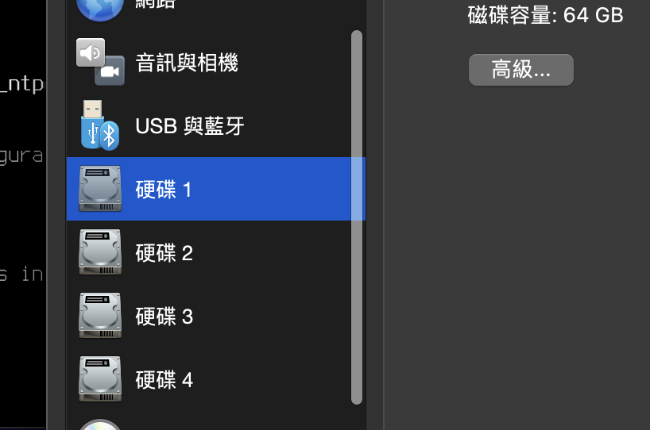
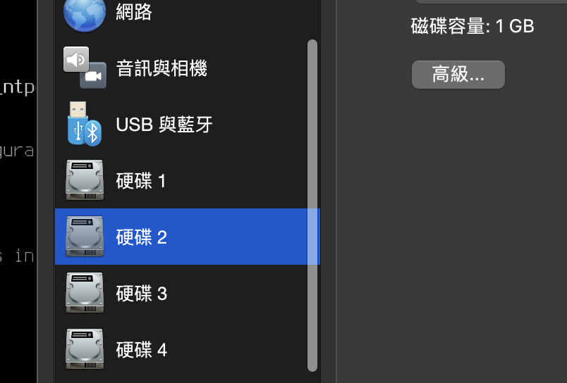

# Writeup

## General
### Add three 1G disks

Attach the three 1GB disks to your FreeBSD VM. Depending on your virtualization platform, you may need to go to the VM settings or disk management section to add the disks.



( orignal 64G disk )


( the other three 1G disk )

Check command : 
```sh
geom disk list | egrep -o 'Mediasize:.*\(1.0G\)' | wc -l # 3
```

- Make sure ZFS will automatically mount after reboot

Nothing to do .

Check command : 
```sh
service -e | grep "^/etc/rc.d/zfs$" # /etc/rc.d/zfs
```

### Install `logrotate`

Command : 
```sh
sudo pkg install logrotate
```

Check Command:
```sh
which logrotate # /usr/local/sbin/logrotate
```

## ZFS Configuration

### Create a ZFS [RAID-Z](https://en.wikipedia.org/wiki/ZFS#ZFS's_approach:_RAID-Z_and_mirroring) pool named `sa_pool` and three 1G disks as devices

1. Identify the device names of the three 1GB disks. 
    Command :
    ```
    dmesg | grep 1024MB
    ```
    Result :
    ```
    ada1: 1024MB (2097152 512 byte sectors)
    ada2: 1024MB (2097152 512 byte sectors)
    ada3: 1024MB (2097152 512 byte sectors)
    ```

2. Create a new RAID-Z pool named `sa_pool` using the three disks. 
    Command:
    ```
    sudo zpool create sa_pool raidz /dev/ada1 /dev/ada2 /dev/ada3
    ```
3. Verify whether the ZFS pool was created successfully

    Command : 
    ```
    sudo zpool list
    ```
    Result:
    ```
    NAME      SIZE  ALLOC   FREE  CKPOINT  EXPANDSZ   FRAG    CAP  DEDUP    HEALTH  ALTROOT
    sa_pool  2.75G   720K  2.75G        -         -     0%     0%  1.00x    ONLINE  -
    zroot    61.5G  2.03G  59.5G        -         -     0%     3%  1.00x    ONLINE  -
    ```
    Command : 
    ```
    sudo zpool status sa_pool
    ```
    Result : 
    ```
    pool: sa_pool
    state: ONLINE
    config:

            NAME        STATE     READ WRITE CKSUM
            sa_pool     ONLINE       0     0     0
            raidz1-0  ONLINE       0     0     0
                ada1    ONLINE       0     0     0
                ada2    ONLINE       0     0     0
                ada3    ONLINE       0     0     0

    errors: No known data errors
    ```

4. Make a new file system called `data` in pool `sa_pool`, set the following
properties `compression=lz4`, `copies=2`, `atime=off` and mount it at
`/sa_data`.
    - Create the file system within the `sa_pool` by running the following command:
    ```
    sudo zfs create sa_pool/data
    ```
    - Set the desired properties for the `data` file system
    ```
    sudo zfs set compression=lz4 sa_pool/data
    sudo zfs set copies=2 sa_pool/data
    sudo zfs set atime=off sa_pool/data
    sudo zfs set mountpoint=/sa_data sa_pool/data
    ```
    - Create the mountpoint directory for the file system
    ```
    sudo mkdir /sa_data
    ```
    - Set permission and ownership 
    ```
    sudo chmod 755 /sa_data
    sudo chown root:wheel /sa_data
    ```
5. Check point : 
    - Check `sa_pool` zpool has been created successfully.
    ```bash
    sudo zpool list -Ho name # stdout contain `sa_pool`
    ```
    - Check `sa_pool/data` zfs has been created successfully.
    ```bash
    sudo zfs get -o value mountpoint sa_pool/data | tail -1  # /sa_data
    sudo zfs get -o value compression sa_pool/data | tail -1 # lz4
    sudo zfs get -o value copies sa_pool/data | tail -1      # 2
    sudo zfs get -o value atime sa_pool/data | tail -1       # off
    ```
    - Check `/sa_data` permission and ownership.
    ```bash
    ls -l / | grep sa_data | cut -d ' ' -f 1   # drwxr-xr-x
    ls -l / | grep sa_data | cut -d ' ' -f 5,7 # root wheel
    ```
## Logrotate

### Add a logrotate configuration

- Add a logrotate configuration file in `/etc/logrotate.d/fakelog`
    - Satisfy the following requirements
        - Set the number of log files to rotate to 10.
        - Set the maximum size of each log file to 1k.
        - Copies the log files to the `/var/log/fakelog/` directory.
    ```sh
    sudo mkdir -p /etc/logrotate.d
    sudo mkdir -p /var/log/fakelog
    sudo vim /etc/logrotate.d/fakelog
    ```
    and paste following configuration :
    ```
    /var/log/fakelog.log {
        rotate 10
        size 1k
        olddir /var/log/fakelog
    }
    ```
- Check point : 
    - Download `fakelogen.py` from gist:
        ```bash
        curl -o fakeloggen.py https://gist.githubusercontent.com/Vincent550102/fbc8a56bc0f6c28624ce1e7b3b8a8c80/raw/c1f0eec843e1121f99400c6adbae7cc5ddfe50d2/fakeloggen.py
        ```
    - Generate fake logs : ( switch `$RANDOM` to any random interger )
    ```
    python3 fakeloggen.py $RANDOM --logrotate
    ```
    - Check command : 
    ```bash
    ls -l /var/log/fakelog/ | sed '1d' | wc -l # 10
    ls -lh /var/log/fakelog/ | tail -10 | awk '{print $5}' | sed "s/K//" | awk '{if ($1 >= 1 && $1 <= 1.5) print "Number is in range"; else print "Number is not in range"}' # all stdout are  `Number is in range`
    ```

## ZFS Managing tools


